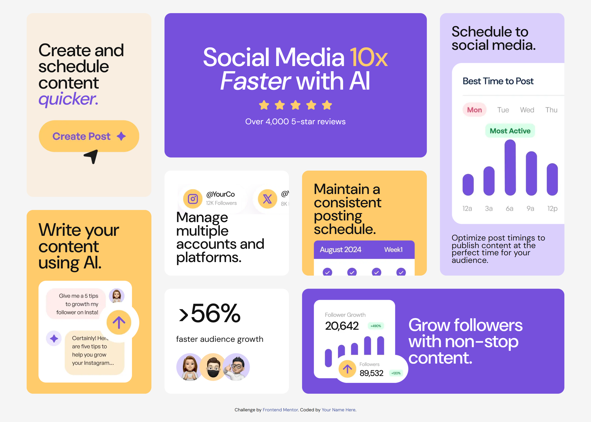

# Frontend Mentor - Bento grid solution

This is a solution to the [Bento grid challenge on Frontend Mentor](https://www.frontendmentor.io/challenges/bento-grid-RMydElrlOj). Frontend Mentor challenges help you improve your coding skills by building realistic projects.

## Table of contents

- [Overview](#overview)
  - [The challenge](#the-challenge)
  - [Screenshot](#screenshot)
  - [Links](#links)
- [My process](#my-process)
  - [Built with](#built-with)
  - [What I learned](#what-i-learned)
  - [Continued development](#continued-development)
  - [Useful resources](#useful-resources)
- [Author](#author)

## Overview

### The challenge

Users should be able to:

- View the optimal layout for the interface depending on their device's screen size

### Screenshot

### Links

- [Solution URL](https://www.frontendmentor.io/solutions/bento-box-grid-KWiCUBa3Jb)
- [Live Site URL](https://monumental-brigadeiros-747169.netlify.app/)

## My process

Last projects I worked on I was using frameworks and libraries. Although my intentions are to learn those along the way, I felt dialing back a notch was necessary for this project. I am still quite unfamiliar to using grid therefor I decided to make it one of my priorities in this challenge.

### Built with

- Semantic HTML5 markup
- CSS custom properties
- Flexbox
- CSS Grid
- Mobile-first workflow

### What I learned

I learned how to breakdown a design into columns and rows to showcase a grid like pattern. Having the Figma file would've probably cut this step.
However learning to step back and looking at the whole picture is something I've learned to be a key skill when developing. Going from mobile to desktop responsiveness sure was interesting, a lot of trial and error. I also realized using class names would cut down a workload for me when it came to styling fonts, colors, weights etc.

### Continued development

I'd like to continue developing more intricate styles, like grids, animations, responsiveness, and whatever other styles become available or trending. Accessibility would also be nice to better understand. Oh, and let's not forget Javascript I know basics but let's be honest it would be a lot cooler to be fluent in it!

### Useful resources

- [Example resource 1](https://developer.mozilla.org/en-US/docs/Web/CSS/grid) - Explained grid styling and its many properties.

## Author

- Portfolio is a Work in process - [Add your name here](https://www.your-site.com)
- Frontend Mentor - [@moncadad](https://www.frontendmentor.io/profile/moncadad)
